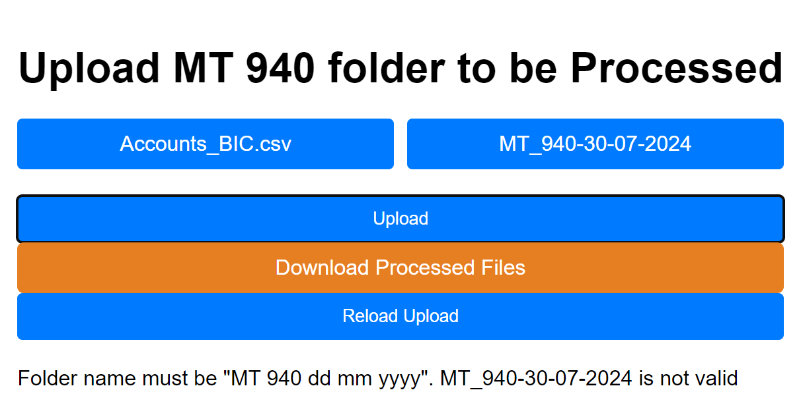
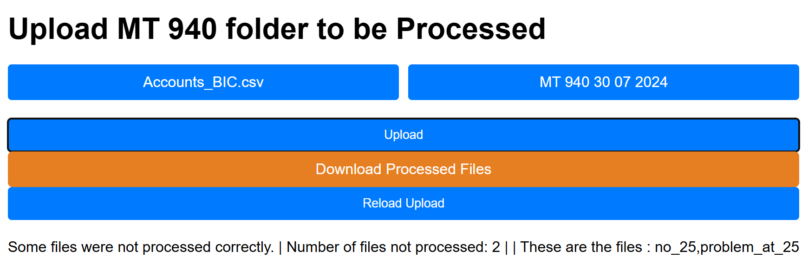
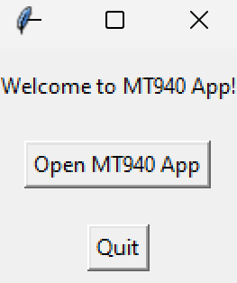
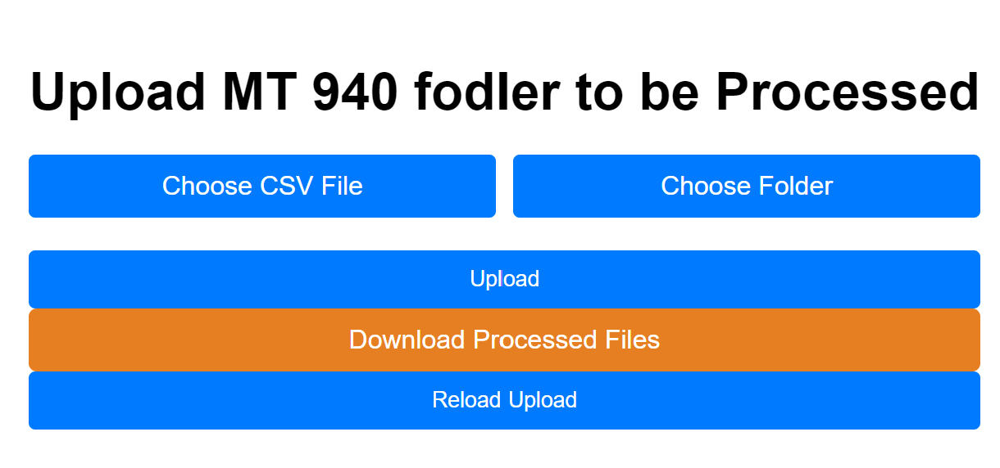
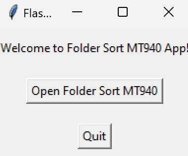
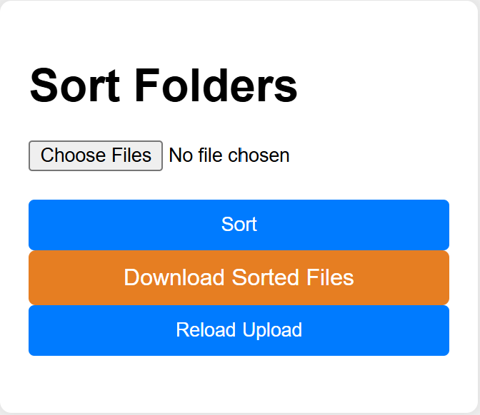
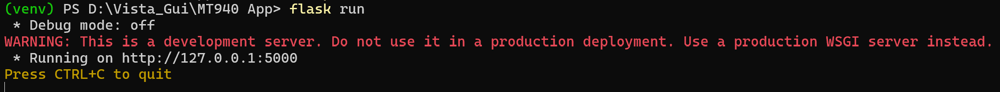

# Guide applications MT940 ADiallo [FR]
Auteur : Abdoulaye DIALLO  
À : Vista GUI  

## Introduction

Ce document décrit les étapes et les fonctionnalités nécessaires pour créer deux applications de bureau en utilisant Python et Flask : l'application MT940 et l'application MT940 Sort Folder. Ces applications sont conçues pour faciliter le traitement et le tri des fichiers de transactions financières, simplifiant ainsi la gestion et l'organisation de grands ensembles de données.

L'application MT940 traite les fichiers générés par le logiciel bancaire, modifie des détails spécifiques comme les numéros BIC, et produit en sortie un fichier texte. L'application MT940 Sort Folder prend ces fichiers traités et les organise davantage en une structure triée basée sur les clients et les devises.

En suivant ce guide, les utilisateurs pourront créer des fichiers exécutables autonomes pour les deux applications en utilisant `pyinstaller`, garantissant un flux de travail fluide et efficace pour la gestion des fichiers MT940.

Cependant, attention car ce code n'est pas encore optimisé et pourrait nécessiter des améliorations. Il s'agit de ma première tentative.

## Application MT940

### Fonctionnalités

Cet exécutable prendra un dossier produit par le logiciel bancaire, puis le téléchargera et le traitera pour modifier les numéros BIC. Le dossier contiendra des fichiers avec les caractéristiques suivantes :

- **Nom de fichier et extension** : `MSG.24212VJLFT82238` (les extensions sont variables)
- **Exemple de contenu de fichier d'entrée** :
```
    {1:-------------------------}{2:I940XXXXXXXXXXXXN}{3:{108:---------------}}{4:
    :20:20240729-99
    :25:----------
    :28C:--/-
    :60F:---------------,--
    :61:--------------,------------------//----------      
    Capitalisation Frais
    :62F:---------------,--
    :64:---------------,--
    -}
```

- **Exemple de sortie**
L'exécutable :
- Renomme le fichier en : `A CLIENT USD 2907.txt`
- Modifie le contenu en :
```
    
    {1:-------------------------}{2:I940ACERTAINBIC}{3:{108:---------------}}{4:
    :20:20240729-99
    :25:----------
    :28C:--/-
    :60F:---------------,--
    :61:--------------,------------------//----------      
    Capitalisation Frais
    :62F:---------------,--
    :64:---------------,--
    -}
    
```
('A CLIENT USD 2907.txt' et 'ACERTAINBIC' sont des exemples)

### Fonctionnement du Code

1. **Création du Dictionnaire** :
    - Mappe chaque numéro de compte à son propriétaire, son numéro BIC, et la devise qu'il utilise.
    - Utilise le fichier `Accounts_BIC.csv` fourni pour realiser cette tâche.
2. **Traitement des Fichiers** :
    - Recherche le numéro de compte dans chaque fichier (précédé par `:25:`).
    - Recherche le numéro de compte dans le dictionnaire pour trouver le numéro BIC et l'éditer dans le fichier après `{2:`.
3. **Renommage des Fichiers** :
    - Crée un nouveau fichier nommé avec le nom du client, la devise et la date (à partir du fichier).
    - Si plusieurs fichiers partagent le même client, devise et date, ils sont numérotés. Les fichiers sont catalogués dans un dictionnaire, avec les clés étant le nom du fichier et les valeurs le nombre de fichiers ayant ce nom.
4. **Sauvegarde des Fichiers** :
    - Sauvegarde le fichier dans un dossier nommé d'après le dossier téléchargé (ex : MT 940 30 07 2024).
    - Le dossier est ensuite compressé et prêt à être téléchargé.
5. **Sortie** : Un dossier compressé contenant les fichiers texte produits.

- **Boutons**
    - Choose CSV File : choisir le fichier CSV contenant les noms de clients, numéro de comptes, et numéro BIC
    - Choose Folder : choisir le dossier contenant les fichiers MT 940 à traiter
    - Upload : commence l'importation des fichiers MT 940 du dossier et le traitement des fichiers
    - Download Processed files : 
      - télécharge le dossier compressé traité
      - une fois le zip téléchargé par l'utilisateur les copies importées sont supprimées    
      - l'utilisateur peut de nouveau importer un dossier dans l'application  
    - Reload Upload :
        - supprime les fichiers importées dans l'application


### Restriction
La seule restriction de l'application est que le dossier qui sera  importé par l'utilisateur devra être nommé du "MT 940 dd mm yyyy". Si le dossier n'est pas conforme, un message apparaittra. 

Capture d'écran de l'application:



### Fichiers corrompus 
Lorsques des fichiers sont corrompus, si ils ne contiennent  pas de numéro de compte ou ne sont pas au bon format. Si cela arrive, l'application va cataloguer ces fichiers et afficher un message listant les fichiers corrompus. L'utilisateur pourra tout de même télécharger les fichiers qui ont pu être traité correctement.


Dans l'exemple si dessous:
- no_25 : ne contient pas ":25:" qui est recherché par l'algorithme pour l'extraction du numéro de compte client
- problem_at_25: ce fichier contient ":25:" mais il n'y a pas de numéro de compte client et donc l'algorithme ne peut pas l'extraire correctement. Dans cet exemple, l'IBAN est renseigné au lieu du numéro de compte, et l'algorithme essai de trouver cet IBAN dans le dictionnaire des numéro de compte et donc échoue.




## Application MT940 Sort Folder

### Fonctionnalités

Cet exécutable prendra un dossier de dossiers MT940 et renverra un dossier contenant les fichiers triés par client :

- **Exemple d'Entrée**

Les dossiers créés par l'application MT940 ressembleront à ceci :

```
MT 940 30 07 2024 (dossier)
    - Client A GNF 2907
    - Client A USD 2907
    - AIR FRANCE EUR 2907
    - AIR FRANCE GNF 2907 2
    - AIR FRANCE GNF 2907
    - ...
```

- **Utilisation de l'application MT940 Sort Folder**

Le dossier créé par l'application MT940 devra d'abord être placé dans un autre dossier avant de pouvoir être trié par l'application MT940 Sort Folder.

```
Dossier A (dossier)
    - MT 940 30 07 2024 (dossier)
    - MT 940 29 07 2024 (dossier)
    - etc ...
```

- **Exemple de Sortie**

L'application MT940 Sort Folder prendra un dossier(Dossier A) contenant des dossiers comme l'exemple ci-dessus et renverra un dossier avec les fichiers triés par client. Au sein de chaque dossier client, les fichiers sont ensuite triés par devise. Le dossier de sortie est nommé "MT940" suivi de l'intervalle des dates des fichiers. Par exemple, si les dossiers MT940 vont du 26/07 au 29/07, le dossier sera nommé `MT940_2607_2907`.

```
MT940_2607_2907 (dossier)
    - Client A (dossier)
        - GNF (dossier)
            - Client A GNF 2607
            - Client A GNF 2907 2
            - Client A GNF 2907
        - USD (dossier)
            - Client A USD 2607
            - Client A USD 2907
    -Client A_ (dossier où les MT940 Client A n'ont pas de devise listée dans le csv)
        - Client A 2607
        - Client A 2907
        -...
```

- **Boutons**
    - Sort : commence le tri des fichiers
    - Download Sorted files : 
      - télécharge le dossier compressé trié
      - une fois le zip téléchargé par l'utilisateur les copies importées sont supprimées 
      - l'utilisateur peut de nouveau importer un dossier dans l'application 
    - Reload Upload :
        - supprime les fichiers importés


### Fonctionnement du Code

1. **Trier les fichiers par préfixe** :
    - Le programme parcourt d'abord le dossier importé et trie les fichiers par leurs préfixes(noms clients) avant l'indicateur de devise.
    - Il crée des dossiers basés sur ces préfixes et copie les fichiers dans les dossiers correspondants.
    - Si aucune devise n'est trouvée dans le nom du fichier, les fichiers sont copiés dans un dossier spécial "noCurrency".

2. **Trier les fichiers sans devise** :
    - Les fichiers dans le dossier "noCurrency" sont ensuite traités.
    - Ils sont triés dans des dossiers basés sur leurs préfixes trouvés avant les numéros dans les noms de fichiers.
    - Ces dossiers sont ensuite déplacés dans le dossier de destination trié.

3. **Trier les fichiers par devise** :
    - Le programme recherche les indicateurs de devise (GNF, USD, EUR) dans les noms de fichiers.
    - Les fichiers sont déplacés dans des sous-dossiers nommés d'après leurs devises respectives au sein de chaque dossier client.

4. **Renommer le dossier trié par dates** :
    - Le programme extrait les dates des noms des dossiers triés.
    - Il identifie les dates les plus anciennes et les plus récentes pour renommer le dossier trié Client An de refléter la plage de dates des fichiers contenus.
    - Le nouveau format du nom de dossier est `MT940_ddmm_ddmm`.

5. **Sortie** :
    - La sortie finale est un dossier compressé contenant des dossiers spécifiques aux clients, chacun étant ensuite organisé par devise.
    - Le fichier zip est créé et téléchargé, garantissant une structure bien organisée pour les fichiers traités.

## Ordre d'Utilisation

1. **Lancez l'application MT940 :**
    - Vous serez accueilli par une petite fenêtre :
    - 
    - Cliquez sur "Open MT940 App" pour ouvrir une page dans le navigateur par défaut.
    - Cliquez sur "Choose CSV File" pour importer le csv clients
    - Cliquez sur "Choose Folder" pour importer le dossier des fichiers MT 940 à traiter
 
2. **Téléchargez le Dossier :**
    - La page permet de sélectionner le dossier à télécharger dans l'application.
    - Une fois sélectionné, cliquez sur "Upload" pour télécharger et traiter le dossier.
    - Un fichier zip avec les fichiers traités sera produit et pourra être téléchargé dans le dossier de téléchargement de l'utilisateur.
    - 

3. **Lancez le Tri de Dossier :**
    - Décompressez le dossier téléchargé par l'application MT940
    - Placez le dossier décompressé dans un autre dossier (appelé Dossier A).
    - Le Dossier A contiendra les dossiers déjà traités par l'application MT940.
    - Avant de lancer "Folder Sort MT940", fermé "MT940 App"(et la petite fenêtre).
    - Lancez l'application Folder Sort MT940
    - 

4. **Trier les Fichiers**
    - Une fois "Open Folder Sort MT940" cliqué, une page s'ouvrira dans le navigateur par défaut :
    - 
    - Après avoir sélectionné le dossier à trier, cliquez sur "Sort" puis téléchargez le dossier trié en cliquant sur "Download Sorted Folder".

#### Création d'Exécutables Python


##### Structure de Mon Code

- **Pour l'application MT940**
    - `templates` (dossier)
        - `index.html`
    - `static` (dossier)
        - `styles.css`
        - `script.js`
    - `app.py`
    - `Accounts_BIC.csv`

- **Pour l'application Folder Sort MT940**
    - `templates` (dossier)
        - `index.html`
    - `static` (dossier)
        - `styles.css`
        - `script.js`
    - `app.py`

Pour essayer et exécuter `app.py` pour chaque application, l'utilisateur doit avoir `flask` installé localement s'il est sur Mac/Linux ou utiliser un environnement Python sous Windows. Pour exécuter `app.py` localement, exécutez `flask run` dans la ligne de commande dans le répertoire de `app.py`. La commande sera exécutée et affichera un lien qui peut être copié et collé dans le navigateur pour visualiser la page web. Dans la capture d'écran ci-dessous, le lien est "http://127.0.0.1:5000" (qui est le localhost de la machine locale).

Capture d'écran du terminal :


Pour créer les exécutables Python, j'ai utilisé `pyinstaller`. C'est un outil puissant qui convertit les scripts Python en exécutables autonomes, permettant d'exécuter votre application sans avoir besoin d'un interpréteur Python installé sur la machine cible. Cela simplifie la distribution et le déploiement, surtout pour les utilisateurs qui ne sont pas familiarisés avec la configuration des environnements Python.

Voici un aperçu des étapes pour créer des exécutables avec `pyinstaller` :

1. **Installer PyInstaller** :
   Assurez-vous d'avoir `pyinstaller` installé. Vous pouvez l'installer en utilisant pip :
   ```bash
   pip install pyinstaller
   ```

2. **Créer les Exécutables** :
   Utilisez les commandes suivantes pour générer les fichiers exécutables pour l'application MT940 et l'application MT940 Sort Folder. Ces commandes regroupent les fichiers HTML/CSS/JS nécessaires et toutes les autres données requises.

   - **Application MT940** :
     ```bash
     pyinstaller --onefile --windowed --add-data "templates;templates" --add-data "static;static" --add-data "Accounts_BIC.csv;." app.py
     ```

   - **Application MT940 Sort Folder** :
     ```bash
     pyinstaller --onefile --windowed --add-data "templates;templates" --add-data "static;static" app.py
     ```

3. **Explication des Options** :
   - `--onefile` : Cette option crée un seul fichier exécutable, simplifiant la distribution car toutes les dépendances sont regroupées dans un seul fichier.
   - `--windowed` : Cette option empêche l'apparition d'une fenêtre de console lorsque l'application est exécutée, utile pour les applications GUI.
   - `--add-data "source;destination"` : Cette option spécifie des fichiers ou dossiers supplémentaires à inclure dans l'exécutable. Le `source` est le chemin vers les données sur votre machine, et le `destination` est le chemin où elles seront placées par rapport à l'exécutable.

- **Créer l'Application MT940**

```bash
pyinstaller --onefile --windowed --add-data "templates;templates" --add-data "static;static" --add-data "Accounts_BIC.csv;." app.py
```

Cette commande crée un fichier exécutable en utilisant les fichiers HTML/CSS/JS fournis et le fichier CSV nécessaire pour télécharger les clients et leurs informations.

- **Créer l'Application MT940 Sort Folder**

```bash
pyinstaller --onefile --windowed --add-data "templates;templates" --add-data "static;static" app.py
```

##### NB:
- Pour éxecuter les commandes `flask` ou `pyinstaller` il faut que le script Python soit nommé `app.py` pour un bon fonctionnement. 
