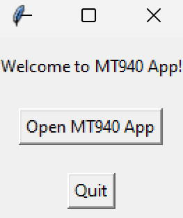
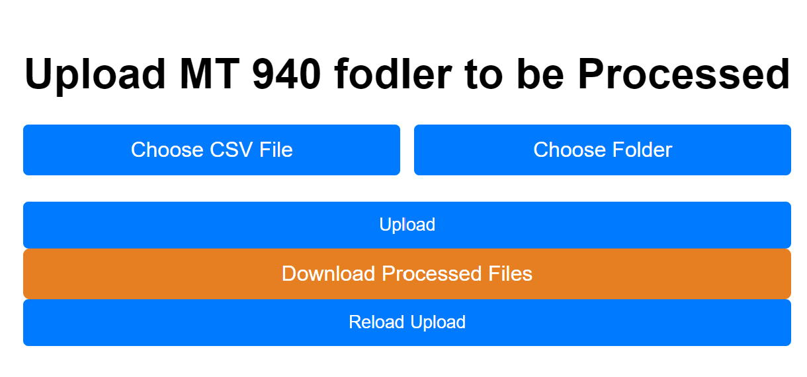

# Guide VistaGui Apps
Author : Abdoulaye DIALLO 
At : Vista GUI 

## Intro

This document outlines the steps and functionalities for creating two desktop applications using Python and Flask: the MT940 App and the MT940 Sort Folder App. These applications are designed to facilitate the processing and sorting of financial transaction files, making it easier to manage and organize large sets of data. 

The MT940 App processes files generated by the bank's software, modifies specific details like BIC numbers, and produces a structured output. The MT940 Sort Folder App takes these processed files and further organizes them into a sorted structure based on clients and currencies.

By following this guide, users will be able to create standalone executable files for both applications using `pyinstaller`, ensuring a smooth and efficient workflow for handling MT940 files.

However, beware because this code is not the best it could be and could very surely need to improved upon. This is my first attempt. 

## MT940 App

### Functionality

This executable will take a folder produced by the bank's software and then upload and process it to edit BIC numbers. The folder will contain files with the following characteristics:

- **Filename and extension**: `MSG.24212VJLFT82238`
- **Input file contents example**:
```
    
    {1:-------------------------}{2:I940XXXXXXXXXXXXN}{3:{108:---------------}}{4:
    :20:20240729-99
    :25:----------
    :28C:--/-
    :60F:---------------,--
    :61:--------------,------------------//----------      
    Capitalisation Frais
    :62F:---------------,--
    :64:---------------,--
    -}
    
```

- **Output Example**
The executable will:
- Rename the file to: `A CLIENT USD 2907.txt`
- Modify the contents to:
```
    
    {1:-------------------------}{2:I940ACERTAINBIC}{3:{108:---------------}}{4:
    :20:20240729-99
    :25:----------
    :28C:--/-
    :60F:---------------,--
    :61:--------------,------------------//----------      
    Capitalisation Frais
    :62F:---------------,--
    :64:---------------,--
    -}
    
```
('A CLIENT USD 2907.txt' and 'ACERTAINBIC' are just examples)

### How the Code Works

1. **Dictionary Creation**: 
    - Maps each account number to its owner, their BIC number, and the currency they use.
    - Uses the `Accounts_BIC.csv` file for the mapping.
2. **File Processing**:
    - Searches for the account number in each file (preceded by `:25:`).
    - Looks up the account number in the dictionary to find the BIC number and edits it into the file after `{2:`.
3. **File Renaming**:
    - Creates a new file named with the client's name, currency, and date (from the file).
    - If multiple files share the same client, currency, and date, they are numbered. The files are cataloged in a dictionary, with the keys being the file name and the values being the number of files with that name.
4. **File Saving**:
    - Saves the file in a folder named after the uploaded folder(e.g: MT 940 29 07 2024).
    - The folder is then zipped and ready to be downloaded.
5. **Output**: A zipped folder containing the text files produced.


- **Buttons**
    - Choose CSV File : choose the CSV file containing the client account numbers, BIC numbers and names
    - Choose Folder : choose the folder containing the MT 940 files to be processed
    - Upload : starts the file upload and processing 
    - Download Sorted files : 
        - download the sorted zipped folder
        - once the download is complete the uploaded folders will be deleted
    - Reload Upload : 
        - removes the uploaded files and allows the user to upload new files


### Restriction
The only restriction of the app is that the uploaded folder must be named in this way "MT 940 dd mm yyyy". If it isnt then the app will print a message.

Screenshot of app:


### Corrupted files
When there are files that are corrupted, if they do not contain account numbers or if the format is incorrect. If that were to occur, the app will catalogue the files and print a message listing the problematic files after the process is completed. The user will still be able to download the files that were processed correctly.

In the example below :
- no_25 : does not contain ":25:" which the algorithm searches for in order to extract the account number
- problem_at_25: this file contains ":25:" however there is no account number, so the algorithm cannot extract it correctly. In this example, the IBAN was reported instead of the account number, the algorithm tries and fails to match the IBAN to the account number dictionary.


## MT940 Sort Folder App

### Functionality

This executable will take a folder of MT940 folders and will return a folder containing the sorted files by client :

- **Input Example**

The folders created by the MT940 App will look like this:

```
MT 940 30 07 2024 (folder)
    - Client A GNF 2907
    - Client A USD 2907
    - Client B EUR 2907
    - Client B GNF 2907 2
    - Client B GNF 2907
    - ...
```

- **Use of MT940 Sort Folder App**

The folder created by the MT940 App will first need to be placed in a folder before it can be sorted by the MT940 Sort Folder App.

```
Folder A (folder)
    - MT 940 30 07 2024 (folder)
    - MT 940 29 07 2024 (folder)
    - etc ...
```

- **Output Example**

The MT940 Sort Folder App will take a folder containing folders like the example above and will return a folder with the files sorted by client. Within each client folder, the files are further sorted by currency. The output folder is named "MT940" followed by the interval of dates of the files. For instance, if the MT940 folders range from 26/07 to 29/07, the folder will be named `MT940_2607_2907`.

```
MT940_2607_2907 (folder)
    - Client A (folder)
        - GNF (folder)
            - Client A GNF 2607
            - Client A GNF 2907 2
            - Client A GNF 2907
        - USD (folder)
            - Client A USD 2607
            - Client A USD 2907
    -Client A_ (folder where the Client A MT940 do not have any currency listed in the csv)
        - Client A 2607
        - Client A 2907
        -...
```

- **Buttons**
    - Sort : starts the file sorting 
    - Download Sorted files : 
        - download the sorted zipped folder
        - once the download is complete the uploaded folders will be deleted
    - Reload Upload : 
        - removes the uploaded files and allows the user to upload new files

### How the Code Works

1. **Sort files by prefix**: 
    - The program first goes through the uploaded folder and sorts the files by their prefixes before the currency indicator.
    - It creates folders based on these prefixes and copies the files into the corresponding folders.
    - If no currency is found in the file name, the files are copied to a special "noCurrency" folder.

2. **Sort files without currency**:
    - The files in the "noCurrency" folder are processed next.
    - They are sorted into folders based on their prefixes found before the numbers in the file names.
    - These folders are then moved to the sorted destination folder.

3. **Sort files by currency**:
    - The program searches for the currency indicators (GNF, USD, EUR) in the file names.
    - Files are moved into subfolders named after their respective currencies within each client's folder.

4. **Rename sorted folder by dates**:
    - The program extracts dates from the sorted folder names.
    - It identifies the oldest and most recent dates to rename the sorted folder to reflect the date range of the contained files.
    - The new folder name format is `MT940_ddmm_ddmm`.

5. **Output**: 
    - The final output is a zipped folder containing client-specific folders, each further organized by currency.
    - The zip file is created and downloaded, ensuring a well-organized structure for the processed files.


## Order of Use

1. **Launch the MT940 App:**
    - You will be welcomed by a small window:
    - 
    - Click on "Open MT940 App" to open a page in the default browser.

2. **Upload the Folder:**
    - The page allows you to select the folder to upload.
    - Once selected, click on "Upload" to upload and process the folder.
    - A zip file with the processed files will be produced and can be downloaded to the user's download folder.
    - 

3. **Launch the Folder Sort:**
    - Unzip the folder downloaded by the MT940 App.
    - Place the unzipped folder in another folder (referred to as Folder A).
    - Folder A will contain folders that have already been processed by the MT940 App.
    - Launch the Folder Sort MT940 App
    - 

4. **Sort the Files**
    - Once "Open Folder Sort MT940" is clicked a page will open on the default browser :
    - 
    - After selecting the folder to sort the clicking "Sort" a folder can be downloaded by clicking "Download Sorted Folder".


#### Python Executable Creation

##### Structure of My Code

- **For the MT940 App**
    - `templates` (folder)
        - `index.html`
    - `static` (folder)
        - `styles.css`
        - `script.js`
    - `app.py`
    - `Accounts_BIC.csv`

- **For the Folder Sort MT940 App**
    - `templates` (folder)
        - `index.html`
    - `static` (folder)
        - `styles.css`
        - `script.js`
    - `app.py`

To try and run the `app.py` for each app the user must have `flask` install locally if on mac/linux or use a python environment on windows. To run `app.py` locally run `flask run` in the command line in the `app.py` directory. The command will be executed and will display a link that can be copied and pasted into the browser to visualize the web page. In the screenshot below, the link is "http://127.0.0.1:5000"(which is the localhost of the local machine).

Terminal screenshot :


To create the Python executables, I used `pyinstaller`. It is a powerful tool that converts Python scripts into standalone executables, allowing you to run your application without needing to have a Python interpreter installed on the target machine. This simplifies distribution and deployment, especially for users who may not be familiar with setting up Python environments.

Here’s a brief overview of the steps to create executables using `pyinstaller`:

1. **Install PyInstaller**:
   Ensure you have `pyinstaller` installed. You can install it using pip:
   ```bash
   pip install pyinstaller
   ```

2. **Create Executables**:
   Use the following commands to generate the executable files for the MT940 App and the MT940 Sort Folder App. These commands bundle the necessary HTML/CSS/JS files and any other required data.

   - **MT940 App**:
     ```bash
     pyinstaller --onefile --windowed --add-data "templates;templates" --add-data "static;static" --add-data "Accounts_BIC.csv;." app.py
     ```

   - **MT940 Sort Folder App**:
     ```bash
     pyinstaller --onefile --windowed --add-data "templates;templates" --add-data "static;static" app.py
     ```

3. **Explanation of Options**:
   - `--onefile`: This option creates a single executable file, making distribution simpler as all dependencies are bundled into one file.
   - `--windowed`: This option prevents a console window from appearing when the application is run, useful for GUI applications.
   - `--add-data "source;destination"`: This option specifies additional data files or folders to be included in the executable. The `source` is the path to the data on your machine, and the `destination` is the path where it will be placed relative to the executable.


- **Create MT940 App**

```bash
pyinstaller --onefile --windowed --add-data "templates;templates" --add-data "static;static" --add-data "Accounts_BIC.csv;." app.py
```

This command creates an executable file using the provided HTML/CSS/JS and the necessary CSV to upload the clients and their information. 

- **Create MT940 Sort Folder App**

```bash
pyinstaller --onefile --windowed --add-data "templates;templates" --add-data "static;static" app.py
```
